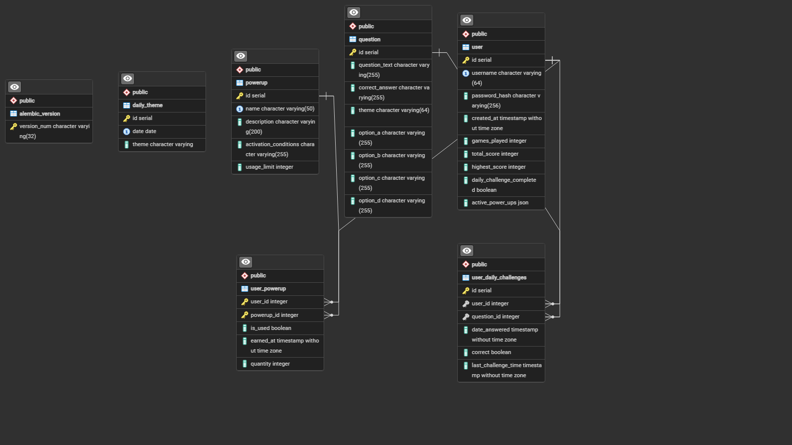

# Lore Master

Live Demo: [https://loremasterfe.up.railway.app/](https://loremasterfe.up.railway.app/)

## The Mythology Trivia Game

**Lore Master** is an interactive trivia game that allows players to test their knowledge of various mythologies from around the world. With daily challenges and an all-time leaderboard, players can compete to see who reigns supreme in the realm of gods and legends.

This project is inspired by my passion for mythology, and I aimed to create an engaging and interactive platform to spark interest in these rich stories while showcasing my skills in SQL databases, Flask applications, and Python. I took a measured approach to development, ensuring my initial goals were attainable before expanding into more complex features. For user authentication, I implemented JWT (JSON Web Tokens), which provided a smoother experience compared to my previous use of bcrypt. I plan to continue enhancing the project by adding new features and refining existing ones. The application is deployed on Railway, where the setup was remarkably straightforward (after thoroughly reading the documentation and stepping away from my earlier brute-force attempts 😅). My PostgreSQL database is also hosted with them.

---

## Table of Contents

- [Features](#features)
- [Usage](#usage)
- [Gameplay](#gameplay)
- [Daily Challenges](#daily-challenges)
- [Leaderboard](#leaderboard)
- [Coming Soon](#coming-soon)
- [Technologies Used](#technologies-used)

---

## Features

- **Mythology-Themed Trivia:** Explore trivia from mythologies such as Norse, Greek, Japanese, and more.
- **Daily Challenges:** New trivia challenges available to play every day.
- **Leaderboards:** Compare your scores against others to see who ranks at the top.
- **Responsive Design:** Enjoy a seamless experience on both desktop and mobile devices.

---

## Usage

1. Log in or register for an account.
2. View your dashboard for your daily challenge.
3. Visit your profile to track stats and view achievements.
4. Play trivia from five different themes.
5. Check the leaderboard to see your standing among other players.

---

## Gameplay

- Players face multiple-choice questions across various mythological themes.
- Correct answers earn points and may provide time bonuses.
- Incorrect answers incur a time penalty.
- The game allows players to pause and resume at any time.

---

## Daily Challenges

Players can attempt the **Daily Challenge** once per day. Currently, the daily challenge serves as a practice question. In future updates, completing the challenge will reward players with special items or bonuses.

---

## Leaderboard

Cumulative scores are tracked and displayed, with the top 10 players featured on the leaderboard. Compete daily to improve your ranking and strive for the top spot.

---

## Coming Soon

- **Chinese Mythology Gameboard:** A thematic expansion featuring questions related to Chinese mythology.
- **Power-Ups:** Special abilities that provide advantages during gameplay:
  - **Thor's Fury:** Doubles points for the next 3 questions.
  - **Athena's Insight:** Removes two incorrect answers, making it easier to identify the correct one.
  - **Loki's Trick:** Allows you to swap the current question for a new one.
  - **Chronos Pause:** Temporarily halts the game timer.
- **Admin Panel:** A dedicated interface for managing game data, player stats, and other controls.
- **Question Updates:** Regular updates to the question pools will ensure fresh content!

---

## Technologies Used

- **Frontend:** React, Redux, JavaScript, Tailwind CSS (I utilized the @apply directive in a separate CSS file for improved code readability during debugging)
- **Backend:** Flask and Python
- **Database:** PostgreSQL
- **Deployment:** Railway
- **REST API:** Flask-RESTful API

---

### Database ERD

